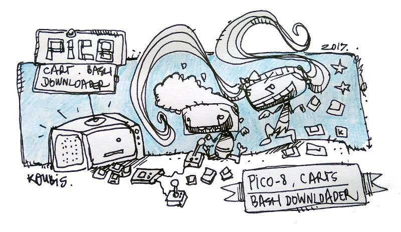

# Pico-8 Carts - Bash Downloader
*Download &amp; automatically rename Pico-8 carts from the Lexaloffle BBS threads*

This bash script downloads directly [Pico-8](http://www.lexaloffle.com/pico-8.php) carts from the [Lexaloffle BBS](http://www.lexaloffle.com/bbs/?cat=7).

# How to use the script

Download the .sh file in this repository and save it in your $PATH, you can also use it locally and call it adding a `./` 

Example: `./picodownload.sh http://www.lexaloffle.com/bbs/?tid=28957`. 

Before launching the script, edit the following line to change the directory where you want to download the carts:

`readonly DOWNLOAD_DIR="/home/bob/.lexaloffle/pico-8/carts/incoming"`

The .sh file has to be executable too: `chmod u+x picodownload.sh`

# The script supports

* **Single threads:** 
`picodownload.sh http://www.lexaloffle.com/bbs/?tid=28957` (the first cart will be downloaded)

* **Index pages:** like the BBS `http://www.lexaloffle.com/bbs/?cat=7` or the featured section `http://www.lexaloffle.com/bbs/?cat=7&orderby=rating`. All the carts listed in the section will be downloaded (around 50 per page if i'm not wrong).

* **Files:** if you want to download all the carts on [your favourite page](http://www.lexaloffle.com/bbs/?orderby=favourites), just save the html file (view source, copy paste in a file). Note: this page is only reachable if you're logged.

# Options
If you want to download anything besides a single cart in a thread, you need to use the options:

* **-p** or **--page** to download all the carts in an index, example: `picodownload.sh -p http://www.lexaloffle.com/bbs/?cat=7`
* **-f** or **--file** to download all the carts from your favourite page. Note: don't use spaces in your filename, i must have forgot some quotes in the script, it bugs out at the moment. Example: `picodownload.sh -f ./lexalol.html`

# Filename

If you download the cart from the following url [http://www.lexaloffle.com/bbs/?tid=29017](funfetched_nanoman-1.0_29017_38515.p8.png), the cart will be saved as: `funfetched_nanoman-1.0_29017_38515.p8.png` 

The structure of the file is the following: `"$AUTHOR_NAME"_"$GAME_TITLE"_"$BBS_ID"_"$GAME_ID".p8.png`. 

The `BBSI_ID` is especially useful if you want to quickly find the original thread where the cart was downloaded from.

You can customize the filename by editing this line in the script:
`local FINAL_FILENAME="$AUTHOR_NAME"_"$GAME_TITLE"_"$BBS_ID"_"$GAME_ID".p8.png`

